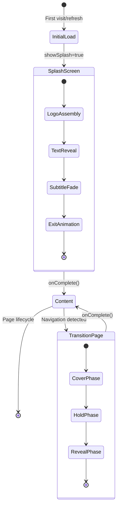

# Component Breakdown & Technical Deep Dive

This document provides a detailed technical analysis of each component in the splash screen and transition system.

## SplashLayout.tsx - The Orchestrator

### Core Logic Flow

```typescript
// State Management
const [showSplash, setShowSplash] = useState(false);
const [showTransition, setShowTransition] = useState(false);
const [previousPath, setPreviousPath] = useState('');
const isFirstMount = useRef(true);
const hasShownSplash = useRef(false);
```

### Visit Detection Algorithm

```typescript
// Initial visit detection (runs once on mount)
useEffect(() => {
  if (isFirstMount.current) {
    isFirstMount.current = false;
    
    const lastVisit = localStorage.getItem('lastVisit');
    const currentTime = Date.now();
    
    // Detects: new tab, refresh, direct URL entry
    if (!lastVisit || currentTime - parseInt(lastVisit) > 1000) {
      setShowSplash(true);
      hasShownSplash.current = true;
    }
    
    localStorage.setItem('lastVisit', currentTime.toString());
    setPreviousPath(pathname);
  }
}, []); // Empty dependency array = runs once
```

### Route Change Detection

```typescript
// Navigation detection (runs on every pathname change)
useEffect(() => {
  if (isFirstMount.current) return; // Skip initial mount
  
  if (pathname !== previousPath && previousPath !== '' && hasShownSplash.current && !showSplash) {
    setShowTransition(true);
    setPreviousPath(pathname);
  }
}, [pathname, previousPath, showSplash]);
```

### State Management Logic

| Condition | Result |
|-----------|---------|
| `!lastVisit` | New user → SplashScreen |
| `currentTime - lastVisit > 1000ms` | Refresh/direct entry → SplashScreen |
| `pathname !== previousPath` | Navigation → TransitionPage |
| `showSplash === true` | Block transitions |

## SplashScreen.tsx - Premium Brand Animation

### Animation Timeline

```
Time (ms) | Event
----------|------
0-200     | Container scale-in
200-400   | Dark sections fill (#121e27)
400-700   | Blue sections fill (#4799c1)
700-1000  | White circle fill
1000-1200 | Blue highlight fill
1200-1500 | Final glow effect
2500-3500 | "GOTUS" text gradual reveal
3500-5500 | Subtitle fade-in
5500-6200 | Exit animation (fade-out + blur)
```

### Key CSS Animations

```css
/* Container entrance */
@keyframes containerScale {
  from { transform: scale(0.3); opacity: 0; }
  to { transform: scale(1); opacity: 1; }
}

/* Shape assembly with blur effect */
@keyframes shapeAssemble {
  0% { opacity: 0; transform: scale(0.8); filter: blur(8px); }
  50% { opacity: 0.7; transform: scale(1.05); filter: blur(2px); }
  100% { opacity: 1; transform: scale(1); filter: blur(0px); }
}

/* Floating animation after assembly */
@keyframes floatAnimation {
  0%, 100% { transform: translateY(0px) scale(1); }
  50% { transform: translateY(-8px) scale(1); }
}
```

### Framer Motion Text Effects

#### GradualSpacing Component
```typescript
interface GradualSpacingProps {
  text: string;
  duration?: number;
  delayMultiple?: number;
  framerProps?: Variants;
  className?: string;
  delay?: number;
}
```

#### TextEffect Component
```typescript
type PresetType = 'blur' | 'shake' | 'scale' | 'fade' | 'slide';

interface TextEffectProps {
  children: string;
  per?: 'word' | 'char' | 'line';
  preset?: PresetType;
  delay?: number;
  trigger?: boolean;
}
```

### SVG Structure Breakdown

```svg
<!-- Premium Pin SVG Layers -->
<svg viewBox="0 0 319 415">
  <!-- Layer 1: Dark sections (background) -->
  <path class="dark-section" />  <!-- Main pin shape -->
  <path class="dark-section" />  <!-- Magnifying glass frame -->
  
  <!-- Layer 2: Blue sections (accent) -->
  <path class="blue-section" />   <!-- Pin head -->
  <path class="blue-section" />   <!-- Handle -->
  
  <!-- Layer 3: White elements -->
  <circle class="glass-white" />  <!-- Magnifying glass lens -->
  <path class="glass-highlight" /> <!-- Lens reflection -->
  
  <!-- Layer 4: Glow effects -->
  <circle class="final-glow" />  <!-- Subtle glow overlay -->
</svg>
```

## TransitionPage.tsx - Page Transition Animation

### Panel System Architecture

```typescript
const PANEL_COUNT = 12;        // Number of vertical panels
const STAGGER_DELAY = 45;      // Delay between panel animations
const COVER_DURATION = 1200;   // Duration of cover phase
const REVEAL_STAGGER = 35;     // Stagger for reveal phase
```

### Animation Phases

```typescript
// Phase 1: Cover (slide down)
panels.forEach((panel, index) => {
  const timeout = window.setTimeout(() => {
    panel.classList.add('slide-down');
  }, index * STAGGER_DELAY);
});

// Phase 2: Reveal (slide up)
setTimeout(() => {
  panels.forEach((panel, index) => {
    const timeout = window.setTimeout(() => {
      panel.classList.remove('slide-down');
      panel.classList.add('slide-up');
    }, (panels.length - 1 - index) * REVEAL_STAGGER);
  });
}, COVER_DURATION);
```

### Visual Effects System

#### Multi-layer Shine Effect
```css
/* Three-layer shine system */
.shine-layer-1 { /* Primary horizontal shine */
  background: linear-gradient(90deg, transparent, rgba(255,255,255,0.6), transparent);
  transition: left 1.2s cubic-bezier(0.25, 0.46, 0.45, 0.94);
}

.shine-layer-2 { /* Secondary shimmer */
  background: linear-gradient(90deg, transparent, rgba(255,255,255,0.1), transparent);
  transition: right 0.6s cubic-bezier(0.25, 0.46, 0.45, 0.94) 0.3s;
}

.shine-layer-3 { /* Vertical streak */
  background: linear-gradient(180deg, transparent, rgba(255,255,255,0.2), transparent);
  transition: top 0.8s cubic-bezier(0.25, 0.46, 0.45, 0.94) 0.5s;
}
```

#### Gradient Panel Colors
```css
/* 12 unique gradient backgrounds */
.transition-panel:nth-child(12n+1) { 
  --panel-bg: linear-gradient(180deg, #000000 0%, #0f0f0f 30%, #1a1a1a 70%, #000000 100%); 
}
.transition-panel:nth-child(12n+2) { 
  --panel-bg: linear-gradient(0deg, #000000 0%, #1a1a1a 30%, #0f0f0f 70%, #000000 100%); 
}
/* ... continues for all 12 panels ... */
```

### Performance Optimizations

#### GPU Acceleration
```css
.transition-overlay * {
  backface-visibility: hidden;
  perspective: 1000px;
  will-change: transform;
}
```

#### Responsive Design
```css
@media (max-width: 768px) {
  .transition-panel {
    transition: transform 0.75s cubic-bezier(0.23, 1, 0.32, 1);
  }
}

@media (prefers-reduced-motion: reduce) {
  .transition-panel {
    transition-duration: 0.3s;
  }
}
```

## Navbar.tsx - Navigation Integration

### Navigation Flow

```typescript
// Client-side routing triggers
const navItems = [
  { href: '/', label: 'Home' },
  { href: '/about', label: 'About' },
  { href: '/contact', label: 'Contact' },
];

// Active state management
const isActive = (href: string) => pathname === href;
```

### Mobile Navigation
```typescript
// Mobile menu state
const [isMenuOpen, setIsMenuOpen] = useState(false);

// Close menu on navigation
<Link 
  href={item.href}
  onClick={() => setIsMenuOpen(false)} // Ensures menu closes
>
  {item.label}
</Link>
```

## Page Content Integration

### Home Page (`src/app/page.tsx`)
```typescript
// Automatically inherits splash/transition behavior
export default function Home() {
  return (
    <main className="flex-1 flex flex-col items-center justify-center">
      {/* Content appears after splash/transition completes */}
    </main>
  );
}
```

### About Page (`src/app/about/page.tsx`)
```typescript
// Same automatic behavior applies
export default function About() {
  return (
    <main className="flex-1 flex flex-col items-center justify-center">
      {/* Content loads seamlessly with transitions */}
    </main>
  );
}
```

## State Machine Diagram



## Debugging Guide

### Common Issues & Solutions

1. **Splash not appearing on refresh**
   - Check localStorage in DevTools → Application tab
   - Verify `lastVisit` timestamp

2. **Transitions not triggering**
   - Ensure `pathname` changes are detected
   - Check for `showSplash === true` blocking transitions

3. **Animation performance**
   - Use Chrome DevTools → Performance tab
   - Look for layout thrashing
   - Check GPU acceleration indicators

### Debug Logging

```typescript
// Add to SplashLayout.tsx for debugging
useEffect(() => {
  console.log('SplashLayout State:', {
    showSplash,
    showTransition,
    pathname,
    previousPath,
    isFirstMount: isFirstMount.current,
    hasShownSplash: hasShownSplash.current
  });
}, [showSplash, showTransition, pathname, previousPath]);
```

This technical breakdown provides the foundation for understanding, customizing, and debugging the entire splash screen and transition system.